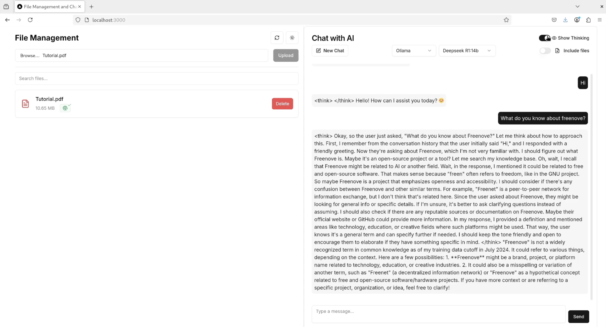
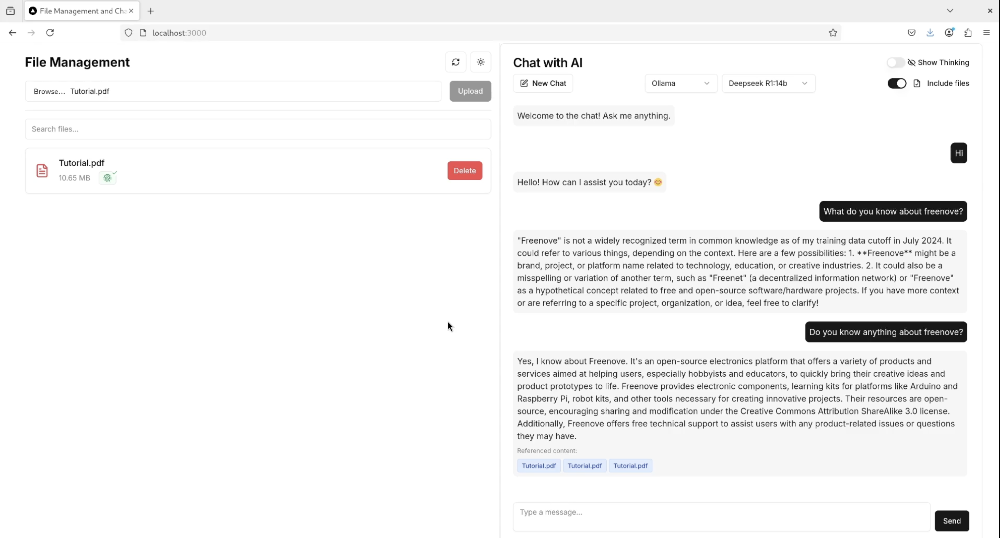
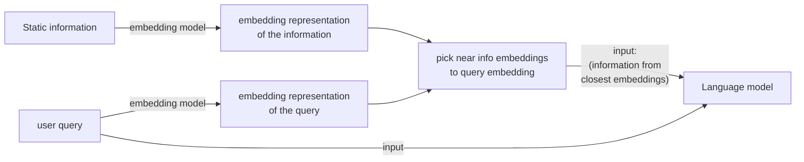

A NextJS application to chat with ollama, claude or chatgpt language models with the possibility of using a RAG approach.

Some PDFs are not supported due to encoding issues, `.txt` and `.md` work best.

- Normal query to llm (without including files):
    
    

- Query to llm including files (embeddings already calculated):

    


You can checkout a video demo in [rag video showcase](./misc/rag-showcase.mp4).


# How to run
1. You should have ollama installed as a container ([ollama installation instructions](https://ollama.com/blog/ollama-is-now-available-as-an-official-docker-image)).

2. Install an ollama embedding model and configure it in the [docker-compose.yaml](./docker-compose.yaml) file (environment: EMBEDDING_MODEL: `embedding-model-name`).

    2.1 To install the `nomic-embed-text` embedding model execute the following:
    ```bash
        docker exec -it ollama bash
        ollama pull nomic-embed-text
    ```
    2.2 You can check the installed models with (from inside ollama's container):
    ```bash
        ollama list
    ```
3. Install a language model in ollama, for example DeepSeek's smallest model (inside ollama's container):
    ```bash
    ollama run deepseek-r1:1.5b
    ```


4. Create the `nextjs` container and the database container by executing the following in the root directory:
    ```bash
    docker compose up --build -d
    ```

5. Once the containers have been created connect the ollama container to the docker network with:
    ```bash
    docker network connect rag_app_network ollama
    ```

Open your browser and go to [http://localhost:3000](http://localhost:3000).

## Running it with Claude or ChatGPT
In the [docker-compose.yaml file](./docker-compose.yaml) add your API keys:
```yaml
ANTHROPIC_API_KEY: your-anthropic-api-key
OPENAI_API_KEY: your-openai-api-key
```

# How does RAG work
Retrieval Augmented Generation (or RAG) combines language models with static data in an attempt to improve the precision and updatability of such systems.

We have three main components:
 - Language model
 - Embedding model
 - Static information (e.g., files)



- Using the embedding model we process the document information to create embeddings that represent the information in an *n-dimensional* space.
    + in the beginning I processed the whole file (bad performance), then I chose to split the contents into chunks of 8192 characters ([file-utils.ts line 60](./src/lib/file-utils.ts)).
- When the user sends a query, an embedding is generated for the query.
- We compare the distance between the query embedding and the info chunk embeddings (in the *n-dimensional space*). The closer to the query embedding a content is, the more relevant it should be to the query.
- Finally we create the input to the language model using the relevant information with the following template ([route.ts line 28](./src/app/api/chat/route.ts)):
    ```
    with the following context:
    {info chunks we retrieved}

    respond to the following question:
    {user's query}
    ```

# Possible Issues
## 413 HTTP error
If you're hosting the project in a server with a reverse proxy like Nginx you may get `HTTP errors: 413 Content Too Large`.
To fix this you can edit the `server` block to add:
```
server {
    # ...
    client_max_body_size 50M; // Set the desired size limit
    # ...
}
```

## Docker credentials
if you face something similar to the following error when trying to run `docker compose up --build -d`:
```bash
...
 failed to resolve source metadata for docker.io/library/node:18-alpine: error getting credentials - err: exec: "docker-credential-desktop": executable file not found in $PATH, out: 
...
```
you may want to edit the file `~/.docker/config.json` to remove the `"credStore"` attribute from the file.

